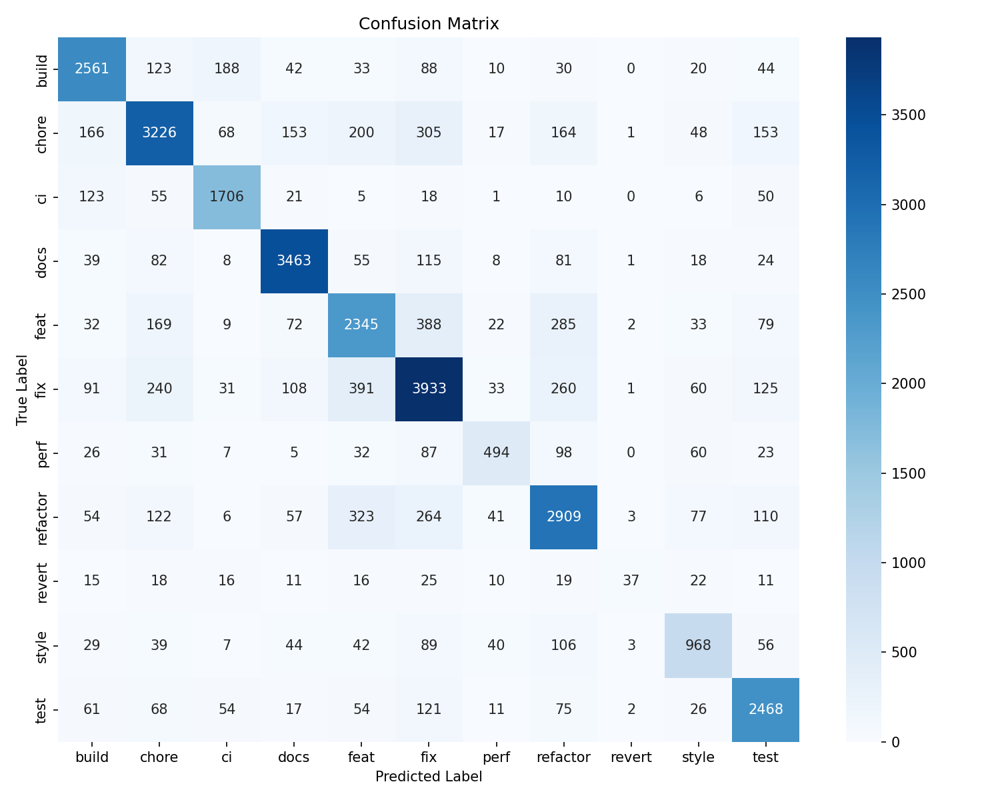

# Git diff type  
[中文](./README_CH.md)
a model for classification your git diff  
Training through commits collected from Github
## model performance
  
The lack of distinctive feature in the **refactor** results in poor judgmental ability of the model