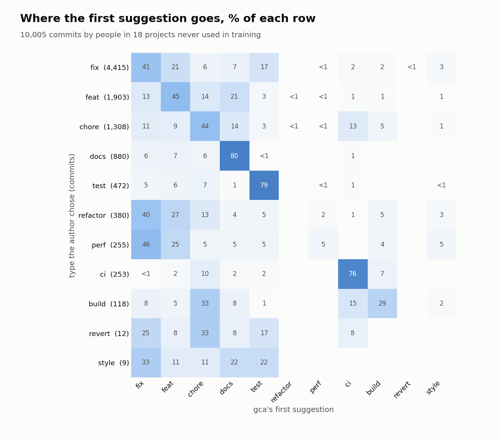

# gca

[中文](./README_CH.md)

Git commit analyzer. One command takes a dirty working tree to a pushed
commit: gca reads the staged diff, suggests a Conventional Commit type with
a small ML model, asks for the subject line, then commits and pushes.

Supported types: `feat` `fix` `docs` `style` `refactor` `perf` `test`
`build` `ci` `chore` `revert`.

```
$ gca
no staged changes; running `git add -A`
Stats: +42 / -7 lines in 3 files

? Commit type
> feat      ( 71.3%)
  refactor  ( 14.9%)
  chore     (  6.2%)

? feat: add user login middleware
[main a1b2c3d] feat: add user login middleware
 3 files changed, 42 insertions(+), 7 deletions(-)
```

## Install

Run `gca-installer.exe`. It copies `gca.exe` to `%LOCALAPPDATA%\gca`, adds
that directory to your user PATH, and installs git with `winget` if git is
missing.

Or build from source:

```
cd gca-rs
cargo build --release --bin gca
# binary: target/release/gca.exe
```

The installer embeds `target/release/gca.exe`, so build `gca` first and then
run `cargo build --release --bin gca-installer`.

## Usage

```
gca                        # stage all if nothing is staged, pick a type, commit, push
gca ./src tests/foo.py     # stage only these paths, then commit and push
gca list ./src             # show what would be staged without staging it
gca --dry-run              # print the suggestion without committing
gca --no-push              # commit only
gca --confirm-push         # ask before pushing
gca --remote origin        # push to this remote for one run
gca --model other.json     # use a different model file
```

### Persistent settings

Settings live in your global git config. Command-line flags override them
for a single run.

```
gca config push ask         # always ask before pushing
gca config push never       # commit only, never push
gca config push auto        # push without asking, the default
gca config push             # show current value

gca config remote upstream  # always push to upstream
gca config remote           # show current remote
```

### Heuristic

When every staged file matches the path rules for `docs`, `test`, or `ci`,
that type is pre-selected. You can still pick another one.

## Model

The classifier is a calibrated LinearSVC trained on repositories that follow
Conventional Commits. Its weights are embedded at build time, so the 11 MB
executable needs no other files.

### Retraining

```
python miner.py --repo <path> --out datasets/<name>.jsonl
python import_external.py --source commitbench --out datasets/commitbench.jsonl
python dedupe.py --input datasets/*.jsonl --output datasets/_merged.jsonl
python train_enhanced.py --data datasets/_merged.jsonl --model out/model_v2.joblib
python export_model.py
python gca-rs/gen_fixtures.py
cd gca-rs && cargo test --release && cargo build --release --bin gca
```

### Performance



`refactor` is the weakest class. Its signal lives mostly in the intent
behind a change, which the diff itself rarely shows.
