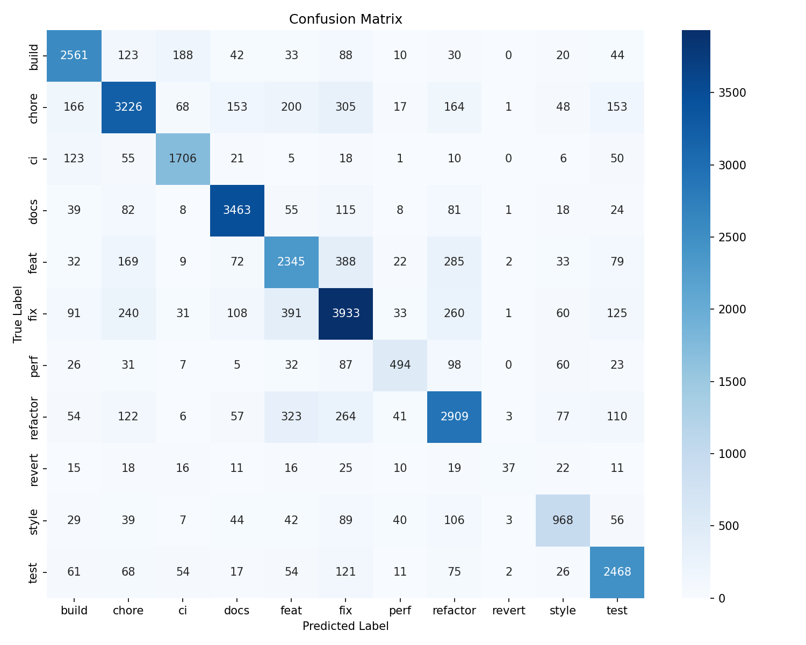

# git-diff-type

[English](./README.md)

分析 staged git diff，判斷對應的 Conventional Commit 類型
(`feat|fix|docs|style|refactor|perf|test|build|ci|chore|revert`)，
並印出可以直接複製的 commit 指令。

```
$ gca
no staged changes; running `git add -A`
Stats: +42 / -7 lines in 3 files

? Commit type
> feat      ( 71.3%)
  refactor  ( 14.9%)
  chore     (  6.2%)

? feat: add user login middleware
[main a1b2c3d] feat: add user login middleware
 3 files changed, 42 insertions(+), 7 deletions(-)
```

一個指令從 dirty tree 到推上遠端：沒 staged 就自動 `git add -A`，
選 type、輸入 subject、commit、push 全在一次互動裡完成。

## 安裝

到 releases 下載 `gca.exe`，或自己編譯：

```
cd gca-rs
cargo build --release
# 產出：gca-rs/target/release/gca（Windows 是 gca.exe）
```

模型權重透過 `include_bytes!` 編入 binary，單一執行檔無需外部依賴。

## 使用

```
gca                     # 預設：沒 staged 會自動 add、選 type、commit、push
gca --no-push           # 當次：只 commit 不 push
gca --confirm-push      # 當次：push 前再問一次
gca --dry-run           # 印出最終 commit message 但不執行
gca --model other.json  # 用外部 JSON 覆寫內建模型
```

push 行為可以持久化到 `git config` 的 `gca.push`：

```
gca config push ask     # 每次 push 前都問
gca config push never   # 只 commit 不 push
gca config push auto    # 自動 push（預設）
gca config push         # 印出目前設定
```

CLI flag 優先於 config，所以單次要變更行為還是可以直接帶 flag。
路徑啟發式（docs / test / ci）若命中，會把對應 type 設成預設游標位置，
但你還是可以選別的。

## 重新訓練

```
python miner.py --repo <path> --out datasets/<name>.jsonl
python import_external.py --dataset commitbench --out datasets/commitbench.jsonl
python dedupe.py --input datasets/*.jsonl --out datasets/_merged.jsonl
python train_enhanced.py --data datasets/_merged.jsonl --model out/model_v2.joblib
python export_model.py --model out/model_v2.joblib --out out/model_v2.json
cd gca-rs && cargo build --release
```

`export_model.py` 把 sklearn pipeline（TF-IDF vocab + IDF、CountVectorizer
vocabs、StandardScaler、LinearSVC 每個 CV fold 的 coef/intercept、sigmoid
校正）全部序列化成 JSON。`verify_export.py` 用純 NumPy 重實作 forward
pass，並和 `predict_proba` 比對誤差 <1e-6。

## Roadmap

- **Remote 選擇** — `gca config push-remote <name>` 與 `--remote <name>`
  可指定 push 的目標 remote，解析順序和 `gca.push` 相同
  （flag > git config > default）。
- **自訂 add 範圍** — `gca ./src ./tests/foo.py` 會把 paths 傳給 `git
  add`，接著進入一般的 classify → pick → subject → commit → push 流程。
  不帶參數的 `gca` 仍保持目前的 add-all 行為。

## 模型表現



`refactor` 類別表現最弱——這個類型的語意主要在改動意圖，而非 diff 表面。
