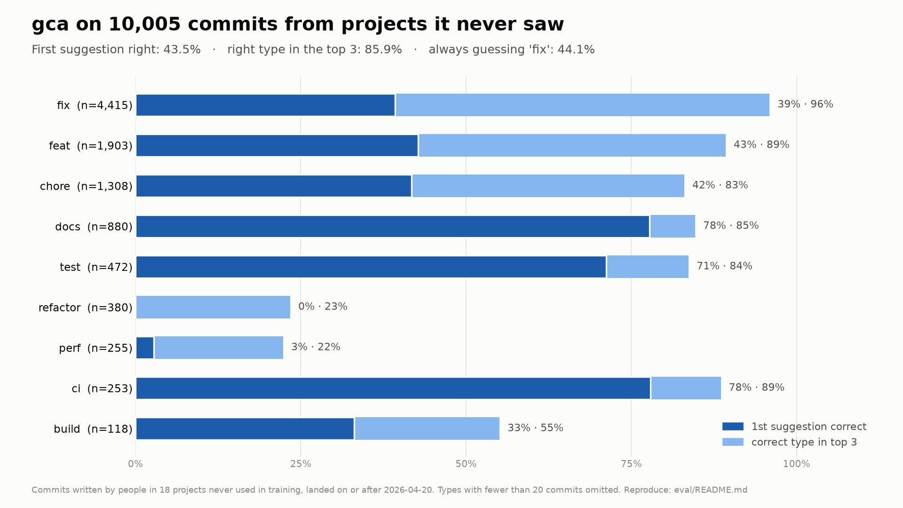
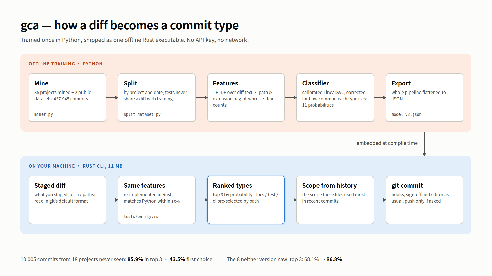

# gca

[English](./README.md)

**寫 commit message 時最卡的，往往是第一個字：這次到底算 `feat`、`fix` 還是 `refactor`？**

gca 讀取你準備 commit 的變更，用內建的 ML 模型排出最可能的 Conventional
Commit 類型，並從專案歷史建議 scope。你確認、輸入一行摘要，它就交給
`git commit` 完成。

- **離線、不需要 API key**：模型編譯進約 11 MB 的單一執行檔，diff 不會離開你的電腦。
- **在沒看過的專案上實測**：10,005 個來自 18 個從未用於訓練的專案、在訓練資料截止後才出現的
  commit，正確類型出現在它列出的三個選項中的比例是 **86.5%**，只看 diff 時第一個建議的
  正確率是 45.5%（gca 0.4：85.9% 與 43.5%）。
- **從歷史學習，什麼都不存**：專案常用的類型、這次要 commit 的檔案以前用過的類型，
  以及你自己最近的 commit 和它當時會給的建議有什麼不同，都會納入考量。加上這些後，
  在同樣這 10,005 個 commit 上，第一個建議的正確率是 **63.8%**，只看 diff 時是 45.5%。
- **照 git 的規矩來**：不會自動暫存、不會自動 push；hooks、簽署、編輯器照常運作。

以下是 [shadcn/ui](https://github.com/shadcn-ui/ui) 的一個真實 commit（模型從沒看過這個專案），用 gca 重新 commit 的過程：

```
$ git add -A
$ gca
3 files  +188 -1
  A .changeset/fix-registry-header-redirect-leak.md
  A packages/shadcn/src/registry/proxy.test.ts
  M packages/shadcn/src/registry/proxy.ts
✔ Commit type · fix       ( 23.8%)
✔ Scope (optional) · shadcn
✔ fix(shadcn): · drop custom registry headers on cross-origin redirects
[fix-redirect-headers fc3ada1d] fix(shadcn): drop custom registry headers on cross-origin redirects
 3 files changed, 188 insertions(+), 1 deletion(-)
 create mode 100644 .changeset/fix-registry-header-redirect-leak.md
 create mode 100644 packages/shadcn/src/registry/proxy.test.ts
```

支援的類型：`feat`、`fix`、`docs`、`style`、`refactor`、`perf`、`test`、
`build`、`ci`、`chore`、`revert`。

## 安裝

**macOS / Linux**：

```
curl -fsSL https://raw.githubusercontent.com/chainchen1103/git-diff-type/main/install.sh | sh
```

**Windows**（PowerShell）：

```
irm https://raw.githubusercontent.com/chainchen1103/git-diff-type/main/install.ps1 | iex
```

在命令提示字元（cmd）裡要交給 PowerShell 執行：
`powershell -c "irm https://raw.githubusercontent.com/chainchen1103/git-diff-type/main/install.ps1 | iex"`

腳本會從最新的 [Release](https://github.com/chainchen1103/git-diff-type/releases)
下載你的平台對應的 gca，用 Release 附的 `SHA256SUMS` 驗證，放到 `~/.local/bin`
（Windows：`%LOCALAPPDATA%\gca`）並把該資料夾加入 PATH，其他東西都不會動。再執行一次就是升級。
移除：`curl -fsSL .../install.sh | sh -s -- --uninstall`；PowerShell 則先設定
`$env:GCA_UNINSTALL = 1` 再執行同一行。`GCA_VERSION=v0.5.1` 可指定版本，`GCA_INSTALL_DIR`
指定資料夾，`GCA_NO_MODIFY_PATH=1` 則不修改 PATH。

預先編譯的執行檔涵蓋 Windows x64（在 Windows on Arm 上也能執行）、macOS（Apple silicon 與 Intel）
和 Linux x86_64。gca 需要 git。

其他安裝方式：

- **Windows 安裝程式**：Releases 裡的 `gca-installer.exe` 做的事和 PowerShell 腳本相同，
  找不到 git 時還會詢問是否用 `winget` 安裝。`gca-installer --uninstall` 可移除。
- **用 Rust 1.80 以上編譯**（任何平台）：
  `cargo install --git https://github.com/chainchen1103/git-diff-type gca-rs --bin gca`
- **從原始碼編譯**：`cd gca-rs && cargo build --release --bin gca` 會產生
  `target/release/gca`（Windows 為 `gca.exe`）。安裝程式會嵌入這個檔案，所以要第二步再編：
  `cargo build --release --bin gca-installer --features installer`。

Shell 補全：`gca completions bash|zsh|fish|powershell`，例如 `gca completions zsh > ~/.zfunc/_gca`。

## 使用

gca 的行為和 `git commit` 一致：它 commit **已暫存（staged）的內容**。

```
git add -p && gca          # 先挑好要 commit 的內容，再執行 gca
gca -a                     # commit 所有已追蹤檔案的變更，同 git commit -a（不含新檔案）
gca src/auth tests/auth    # 只 commit 這些路徑（包含新檔案），其他已暫存的內容保持不動
```

沒有任何暫存的變更時，gca 不會替你暫存，而是列出 `git status` 和做法後結束。

互動流程：

1. **類型**：依機率排序。排序會參考 diff、事先已知的摘要（`-m` 或[草稿](#摘要草稿)），
   並偏向這個專案、這些檔案和你自己在最近 500 個 commit 裡常用的類型（見[參考專案歷史](#參考專案歷史)）。
   按 Enter 採用預選的；不在前幾名時選「other type…」。
2. **Scope**：只有專案本身在用 scope 時才會問。預填的是**這些檔案過去最常用的 scope（或不加 scope）**，
   沒有的話看最接近的目錄（從最近 500 個 commit 學來，不計 bot，你自己的 commit 份量較重），可直接改或清空。
3. **摘要**：一行描述。機械性的變更會先擬好一個，例如 `bump zod from 3.22.0 to 3.23.8`、
   `release v1.1.0`（見[摘要草稿](#摘要草稿)）：按 Enter 採用、直接打字取代、按 Tab 放到輸入列上修改。
   整行 header 超過 100 字元會被擋下（commitlint 的預設上限）。

設定 `gca config order subject-first` 後會先問摘要，再用摘要一起排序類型，第一個建議正確的機會大幅提高
（見[參考摘要](#參考摘要)）。選好的類型與 scope 讓 header 超過長度時，gca 會請你縮短摘要。

Esc 或 Ctrl-C 隨時取消，暫存區不受影響。`-a` 和指定路徑都先在暫存區的臨時副本上試算，
取消時真正的暫存區完全不變。

### 選項

```
-t, --type <TYPE>     指定類型，不詢問
    --scope <SCOPE>   指定 scope，不詢問；"" 代表不加
-m, --message <MSG>   摘要；重複使用可加上內文段落，同 git commit -m
-b, --breaking        標記為 breaking change（feat!: ...）
-y, --yes             直接採用建議的類型與 scope
-e, --edit            commit 前用編輯器開啟訊息
-n, --no-verify       略過 pre-commit 與 commit-msg hook
-s, --signoff         加上 Signed-off-by
    --push            commit 後 push；沒有 upstream 時自動設定
    --confirm-push    push 前先確認；--no-push 則不 push
    --remote <NAME>   push 到這個遠端，而不是分支的 upstream
    --dry-run         只顯示建議，不暫存、不 commit
    --dry-run --json  輸出 JSON，給腳本或編輯器整合使用
    --topk <N>        列出幾個建議（預設 3）
    --model <FILE>    使用匯出的 JSON 模型，取代內建模型
```

不需互動、可放進腳本：`gca -a -t fix -m "handle empty diff"`（專案有用 scope 時再加上
`--scope <scope>`，不要 scope 則用 `--scope ""`），或 `gca -y -m "update guide"` 直接採用建議的類型與 scope。
沒有終端機時，gca 會列出還缺哪些參數，而不是卡住。

用 `-m` 給的摘要也會拿來判斷類型，第一個建議正確的機會大幅提高，見[參考摘要](#參考摘要)。

結束代碼：`0` 已 commit（或 dry run 完成）、`1` 沒有可 commit 的內容／取消／git 失敗、
`2` 參數錯誤、`130` Ctrl-C。

### 設定

設定存在 git config；預設寫入全域，加 `--local` 只作用於目前的儲存庫。命令列選項優先。

```
gca config push                 # 顯示目前設定（預設 never：不 push）
gca config push ask             # commit 後詢問是否 push
gca config push auto --local    # 這個儲存庫每次都 push
gca config remote upstream      # push 到這裡（未設定時：分支的 upstream，其次 origin）
gca config order subject-first  # 先問摘要，再用摘要一起排序類型
gca config order type-first     # 先問類型（預設）
```

`gca.push` 或 `gca.order` 的值無效時，gca 會在暫存任何東西之前就停止。

### Commit hook

`gca hook install` 會在儲存庫加上 `prepare-commit-msg` hook（有設定 `core.hooksPath` 時裝在那裡），
讓不經過 gca 的 commit 也有類型：

- `git commit -m "make parsing faster"`，以及直接送出訊息框內容的 git 圖形介面：前面會加上
  `gca -y` 會選的類型，例如 `perf: make parsing faster`。和 `gca -m` 一樣，摘要也會拿來判斷類型。
- `git commit` 開啟編輯器時：第一行先填好類型，有草稿時接著填上摘要，排序結果以註解列在下面。
- 已經以類型或其他 `word:` 開頭的訊息、merge、revert、cherry-pick、rebase 與 amend 都保留原本的訊息。

hook 絕不會擋下 commit。`GCA_HOOK=0 git commit ...` 可以略過一次，`gca hook uninstall` 則會移除它。
已經有別的 hook 時，gca 不會覆蓋，請改在那個 hook 裡加上 `gca hook run "$@" || true`。

### commitlint

專案有 commitlint 設定時，gca 會遵守其中等級 2（commitlint 會擋下 commit）的 `type-enum` 與 `header-max-length`：
只建議允許的類型，專案自訂的類型（例如 `deps`）會列在「other type…」裡、也能用 `-t` 指定，header 長度上限也改用專案的設定而不是 100。

`.commitlintrc`、`.commitlintrc.json` 與 `package.json` 的 `commitlint` 欄位以 JSON 讀取。JavaScript、TypeScript、YAML
設定無法在這裡執行，所以只有當這兩條規則直接寫成字面值時才讀得到，例如 `'type-enum': [2, 'always', ['feat', 'fix', 'deps']]`；
另外也知道 `@commitlint/config-angular` 沒有 `chore`。`--dry-run --json` 的 `commitlint` 欄位會顯示讀到的內容。

### 預選規則

當所有變更的檔案都屬於文件、測試或 CI 設定（例如 `docs/`、`*_test.go`、`.github/workflows/`），
會預選 `docs`、`test` 或 `ci`（前提是模型有這個類型），你仍可改選其他類型。發版（見下方）也同樣會預選 `chore`。

### 摘要草稿

只有暫存的變更符合下列模式時，gca 才會擬好摘要：

| 暫存的變更 | 草稿 |
| --- | --- |
| `package.json`、`Cargo.toml`、`pyproject.toml`、`requirements*.txt`、`go.mod` 或 workflow 的 `uses:` 裡的依賴版本 | `bump zod from 3.22.0 to 3.23.8`、`downgrade …`、`bump vite and vitest`、`bump 12 dependencies` |
| 新增或移除依賴 | `add tempfile dependency`、`remove 3 dependencies` |
| 只有 lockfile | `update Cargo.lock`、`update lockfiles` |
| 套件本身的版本，連同 lockfile 與 changelog | `release v1.1.0`，並預選 `chore` |
| 只搬移或改名、內容沒改的檔案 | `rename lib.rs to core.rs`、`move util.rs to src/core/`、`rename lib/a/ to lib/b/` |
| 刪除檔案 | `remove scripts/old.sh`、`remove 4 files from legacy/` |
| 新增或刪除測試、一份文件或一個 workflow 檔 | `add tests for parser`、`add install docs`、`add release workflow` |
| 文件裡只改一個字的錯字 | `fix typo in README` |

其他變更都不會有草稿，包括連同程式碼一起改的依賴升級：像「update README」這種籠統的摘要，人很少照用。
`--dry-run` 會印出草稿，`--dry-run --json` 則放在 `subject_draft`。

在[準確率](#準確率)的三組測試資料中，人寫的 commit 有 5.2% 會拿到草稿（141,213 個中的 7,402 個）：
3,359 個依賴變更、2,146 個發版，以及 1,897 個搬移、刪除、新增檔案與錯字修正。發版的 commit，
作者有 96.6% 選了 `chore`。草稿寫的是改了什麼，作者常寫的卻是為什麼改，只有 6.8% 的摘要與草稿一字不差，
所以草稿只是預設值，直接打字就能換掉。

### 模型寫的草稿（實驗性）

gca 也能用一個小型神經網路模型替任何變更起草摘要：在同一批 commit 上微調的 CodeT5-small
（[draft_model/](draft_model/README.md)）。它離線在 CPU 上執行，需要以 `t5` feature 建置，
並另外下載 67 MB 的模型檔（還沒有隨版本發佈，`draft_model/README.md` 說明了怎麼做出來）：

```
cargo install --path gca-rs --features t5
gca config draft-model path/to/gca-draft-q8.gguf
```

模型讀的是你選的類型與 scope、檔案、幾個先前 commit 的標頭和變更的行。它在類型選單開著時於背景起草，
用的是 gca 建議的類型與 scope；你選了別的就重寫一次。模型夠有把握時（各 token 的平均對數機率在 -0.3 以上）
才會提供它的草稿，否則照舊由上面的規則起草。在 gca 沒看過的專案的近期 commit 上，14.5% 的 commit 會拿到模型草稿，
其中 34.3% 與作者寫的摘要完全相同，56.0% 至少省下一半的打字。

`--dry-run` 會印出模型的草稿和信心（不論有沒有提供）；`--dry-run --json` 放在 `model_draft`，
`subject_draft_source` 則說明 `subject_draft` 是模型還是規則寫的。`--draft-model <FILE>` 或
`GCA_DRAFT_MODEL` 可只對這次指定模型檔，`GCA_DRAFT_MODEL` 設為空字串則關閉模型。每次起草約花半秒 CPU 和
250 MB 記憶體。commit hook 不使用模型。

## 準確率

模型以 **437,945 個 commit** 訓練，來自 5,925 個儲存庫：其中 342,347 個是 36 個遵循 Conventional Commits 的開源專案裡由人寫、2026-04-20 以前的 commit（不含 bot），另外 95,598 個來自公開資料集 CommitChronicle 與 CommitBench，並已排除所有測試專案所屬組織的資料。測試資料取自公開儲存庫，分成三組：

| 測試資料 | commit 數 | 第一個建議正確 | 正確類型在前 3 | 各類型平均召回率 | 對照：永遠猜最常見類型 |
| --- | ---: | ---: | ---: | ---: | ---: |
| **沒看過的專案**，訓練後才出現的 commit | 10,005 | **45.5%** | **86.5%** | 44.3% | 44.1% (`fix`) |
| 沒看過的專案，較早的歷史 | 91,617 | 45.9% | 84.3% | 36.9% | 35.2% (`fix`) |
| 訓練過的專案，訓練後才出現的 commit | 39,591 | 58.8% | 90.2% | 46.1% | 39.2% (`fix`) |

「沒看過的專案」共 18 個，例如 vite、vue、electron、nest、superset、rolldown，與所有訓練資料分屬
不同組織；任何與訓練資料 diff 相同的 commit 都已移除。以上都只計算由人寫的 commit；
bot 產生的 commit 另外統計在 `eval/results.json`。

**各類型平均召回率**是每個類型中第一個建議就正確的比例，再對類型取平均。在第一列，永遠回答 `fix`
的第一個建議會有 44.1% 是對的，但它的各類型平均召回率只有 11.1%，因為其他類型
一個都不會對。gca 的第一個建議則分散到各類型，其餘交給三個選項的清單。



與 gca 0.4 的模型在同一批 commit 上的比較（0.4 → 0.5）：

| 測試資料 | 第一個建議正確 | 正確類型在前 3 | 各類型平均召回率 |
| --- | ---: | ---: | ---: |
| 沒看過的專案，訓練後的 commit | 43.5% → 45.5% | 85.9% → 86.5% | 42.9% → 44.3% |
| 沒看過的專案，較早的歷史 | 44.6% → 45.9% | 83.7% → 84.3% | 36.2% → 36.9% |
| 訓練過的專案，訓練後的 commit | 58.0% → 58.8% | 89.7% → 90.2% | 44.9% → 46.1% |

模型現在也會讀「行為是否改變」的跡象：只是搬移、改名或重新排版的行、註解、新增／刪除／改名的檔案與測試檔，
以及新增的行裡和效能有關的字。在第一列，`test` commit 第一個建議就是 `test` 的比例從 71.2% 提高到 79.4%，
`feat` 從 42.7% 到 45.4%，`perf` 從 2.7% 到 4.7%；`build` 與 `ci` 略降。

`docs`、`test`、`ci` 最準，因為檔案路徑本身就有訊號。`refactor` 與 `perf` 最弱：它們和其他
變更的差別在於**意圖**，diff 很少透露，行為跡象也沒有改變這一點。這也是 gca 給你排序好的清單、而不是替你決定的原因；
commit 前請確認建議的類型。

### 參考摘要

摘要在選類型之前就已知時（`-m` 或[草稿](#摘要草稿)），gca 也會讀它：「speed up」「rename」這類字眼
說出了 diff 看不出的意圖。在同一批 commit 上，用作者自己寫的摘要（去掉類型前綴）測試：

| 測試資料 | 只看 diff | 只看摘要 | 兩者合併（gca 的做法） |
| --- | ---: | ---: | ---: |
| **沒看過的專案**，訓練後的 commit | 45.5% · 86.5% · 44.3% | 58.0% · 86.6% · 36.5% | **61.7% · 90.8% · 51.6%** |
| 沒看過的專案，較早的歷史 | 45.9% · 84.3% · 36.9% | 55.1% · 85.7% · 34.8% | 58.1% · 88.6% · 45.8% |
| 訓練過的專案，訓練後的 commit | 58.8% · 90.2% · 46.1% | 60.5% · 88.2% · 38.7% | 68.3% · 93.9% · 52.7% |

每格依序是：第一個建議正確 · 正確類型在前 3 · 各類型平均召回率。在第一列，`refactor` 從從未排第一
變成 26.1%，`perf` 從 4.7% 提高到 20.0%。檔案路徑本身就看得出的類型略降（`docs` 80.0% → 76.1%）或持平
（`ci` 76.3% → 77.1%），`test` 降得較多（79.4% → 64.0%）；所有檔案都符合時，預選規則仍會預選這三種。

摘要模型是以單字與相鄰兩字為特徵的邏輯斯迴歸，用和 diff 模型相同的 commit 的摘要訓練（`train_subject.py`）。
gca 把兩個模型的機率相乘：摘要的機率取 0.25 次方，並以 0.15 次方除去各類型在訓練資料中的比例。
這兩個設定是在另外保留的六個訓練專案上選的，沒有用到測試資料。
想讓每次 commit 都參考摘要，就設定先問摘要：`gca config order subject-first`。

### 參考專案歷史

每個專案都有自己的習慣：有的把依賴更新歸在 `chore`，有的歸在 `build`；有的從不寫 `refactor`。
gca 會統計最近 500 個 commit 裡由人寫的類型（不計 bot），在與訓練資料的比例不同之處，把排序往這個專案的習慣調整。
檔案也有習慣，所以接著再用同樣的方式，把排序往這 500 個 commit 中動過你這次要 commit 的檔案的那些 commit 的類型調整。
測試時每個 commit 只看得到在它之前的 commit：

| 測試資料 | 只看 diff | diff＋歷史 | diff＋摘要 | diff＋摘要＋歷史 |
| --- | ---: | ---: | ---: | ---: |
| **沒看過的專案**，訓練後的 commit | 45.5% · 86.5% · 44.3% | 58.0% · 91.5% · 55.1% | 61.7% · 90.8% · 51.6% | **68.3% · 94.6% · 59.5%** |
| 沒看過的專案，較早的歷史 | 45.9% · 84.3% · 36.9% | 55.1% · 90.2% · 42.8% | 58.1% · 88.6% · 45.8% | 64.8% · 93.5% · 50.5% |
| 訓練過的專案，訓練後的 commit | 58.8% · 90.2% · 46.1% | 60.8% · 93.0% · 51.3% | 68.3% · 93.9% · 52.7% | 68.9% · 95.0% · 55.7% |

（第一個建議正確 · 正確類型在前 3 · 各類型平均召回率）。在沒看過的專案上，只參考專案的類型比例時，
第一個建議正確率是只看 diff 53.8%、加上摘要 67.2%，其餘的提升來自動過相同檔案的 commit。
歷史對沒看過的專案幫助最大；訓練過的專案，模型早已學到它們的習慣。兩部分的份量都是在另外保留的六個訓練專案上選的：
專案的類型比例權重 0.1（有摘要時 0.25），以相當於 10 個 commit 的訓練比例平滑；相同檔案的類型比例權重 0.1（有摘要時 0.15），
以相當於 5 個 commit 的訓練比例平滑。類型比例和訓練資料相同的專案，排序不會改變；歷史裡沒有 Conventional Commits 的專案不受影響。

### 參考你自己的 commit

每個人也有自己的習慣：有人把依賴更新歸在 `build`，有人歸在 `chore`；有人小改動都寫 `fix`，有人寫 `refactor`。
gca 會從這 500 個 commit 中找出你最近的 10 個（git 設定的 email 或名字相同），用模型重新讀一次，
比較它當時會給的建議和你實際選的類型：你選得比它建議得多的類型會往前，選得少的會往後。
每次都直接從歷史讀，不需要設定，也不會另外存任何東西。測試時把每個 commit 的作者當成「你」，
並疊加在專案歷史之上：

| 測試資料 | diff＋歷史 | ＋你的 commit | diff＋摘要＋歷史 | ＋你的 commit |
| --- | ---: | ---: | ---: | ---: |
| **沒看過的專案**，訓練後的 commit | 58.0% · 91.5% · 55.1% | **63.8% · 93.0% · 56.2%** | 68.3% · 94.6% · 59.5% | **70.8% · 94.9% · 60.3%** |
| 沒看過的專案，較早的歷史 | 55.1% · 90.2% · 42.8% | 60.8% · 92.1% · 44.6% | 64.8% · 93.5% · 50.5% | 67.9% · 94.6% · 50.5% |
| 訓練過的專案，訓練後的 commit | 60.8% · 93.0% · 51.3% | 64.8% · 93.7% · 51.5% | 68.9% · 95.0% · 55.7% | 70.8% · 95.2% · 55.5% |

這些 commit 中有 87% 到 91% 的作者，在那 500 個 commit 裡有更早的 commit。比較結果的份量
（權重 0.1，有摘要時 0.15，並以相當於 1 個 commit 的訓練比例平滑）是在另外保留的六個訓練專案上選的。
gca 0.4 在第一列是 62.3% · 92.5% · 54.4% 與 70.2% · 94.6% · 59.2%；這張表和上一張表的每一格，gca 0.5 都比它高。

### Scope 建議

在有用 scope 的專案裡，gca 會預填 scope：看最近 500 個 commit 中動過相同檔案的那些，沒有的話看和它們共用最深目錄的那些，
取其中最常用的 scope；如果大多數沒有 scope，就不預填。你自己的 commit 算 8 票。gca 0.3 只計算有 scope 的 commit，
所以幾乎總是會預填一個。以下是預填內容和 commit 實際的 scope 完全相同（沒有 scope 時為空白）的比例，測試時把每個 commit 的作者當成「你」：

| 測試資料 | gca 0.3 | 現在 |
| --- | ---: | ---: |
| **沒看過的專案**，訓練後的 commit | 42.1% | **52.7%** |
| 沒看過的專案，較早的歷史 | 38.7% | 63.6% |
| 訓練過的專案，訓練後的 commit | 45.5% | 56.1% |

這些改動的比較、以及你自己的 commit 該算幾票，都是在另外保留的六個訓練專案上決定的，那裡的比例從 47.0% 提高到 63.3%。

完整數字與重現方式見 [eval/README.md](eval/README.md)。

## 運作方式



1. **資料**：`miner.py` 從遵循 Conventional Commits 的儲存庫挖出 (diff, type) 配對；
   `split_dataset.py` 依專案與日期切出訓練集和三組測試集。`import_external.py` 與
   `eval/prepare_external.py` 加入公開資料集，同時避開測試專案。
2. **訓練**：TF-IDF（diff 內容）＋檔案路徑與副檔名詞袋＋新增與刪除詞彙的重疊程度＋增刪行數＋
   行為是否改變的跡象（只是搬移、改名或重新排版的行、註解、新增／刪除／改名的檔案與測試檔、和效能有關的字），
   餵給機率校準過的 LinearSVC，輸出 11 個類型的機率。diff 只讀前 20,000 個字元。
   接著依各類型在訓練資料中的常見程度修正機率（`eval/tune_prior.py`）；不這樣做的話，
   大部分的 diff 都會被判成 `fix`。摘要在選類型前已知時，
   另一個較小的模型會讀摘要：以單字與相鄰兩字為特徵的邏輯斯迴歸（`train_subject.py`，
   見[參考摘要](#參考摘要)）。
3. **匯出**：`export_model.py` 把整條 sklearn pipeline 攤平成 `out/model_v2.json`；
   `train_subject.py` 直接寫出 `out/subject_model.json`。
4. **推論**：Rust CLI 在編譯時嵌入這兩份 JSON，自己實作同樣的前向運算，所以安裝後只需要 git，
   不需要 Python 或模型檔。`gca-rs/tests/parity.rs` 驗證 Rust 與 Python 的機率誤差小於 1e-6
   （摘要模型小於 1e-9）。執行時 gca 也會讀儲存庫最近 500 個 commit，用來建議 scope，並參考這個專案與這次要 commit 的檔案通常用的類型，
   再把其中你自己最近的 commit 重新讀一次。
   匯出新權重後，重新編譯 CLI，或用 `--model` 指定 JSON。

gca 讀 diff 時固定使用 git 的預設格式（不受 `diff.noprefix`、`color.ui` 等個人設定影響），
和訓練資料的格式一致。

### 重新訓練

需要 Python 3.11+ 與 `pip install -r requirements.txt`，在專案根目錄執行：

```
bash eval/collect.sh                    # 下載 eval/repos_*.txt 的專案、挖掘、切分到 datasets/
pip install -r requirements-import.txt  # 公開資料集（需要網路）
python import_external.py --source commitchronicle --out datasets/commitchronicle.jsonl
python import_external.py --source commitbench --out datasets/commitbench.jsonl
python eval/prepare_external.py --inputs datasets/commitchronicle.jsonl datasets/commitbench.jsonl \
    --test-repos eval/repos_test.txt --out datasets/external.jsonl \
    --against datasets/train.jsonl datasets/test_*.jsonl
python eval/tune_c.py --data datasets/train.jsonl   # 只用訓練專案挑選正則化強度 C
python train_enhanced.py --stream --data datasets/train.jsonl datasets/external.jsonl --C 0.1
python eval/tune_prior.py --write 0.9   # 依類型常見程度修正（見 eval/README.md）
python export_model.py
python verify_export.py --data datasets/test_unseen_recent.jsonl
python gca-rs/gen_fixtures.py --synthetic --out gca-rs/tests/synthetic_fixtures.json
python gca-rs/gen_fixtures.py --data datasets/test_unseen_recent.jsonl
bash eval/run.sh                        # 在三組測試集上評估
python eval/tune_fusion.py ...          # 摘要要佔多少份量（見 eval/README.md）
python train_subject.py --data datasets/train.jsonl datasets/external.jsonl --weight 0.25 --prior-power 0.15
python train_subject.py --write-fixtures gca-rs/tests/subject_fixtures.json \
    --fixture-data datasets/test_unseen_recent.jsonl
python eval/evaluate_subject.py --sets datasets/test_*.jsonl
python eval/tune_history.py ...         # 專案歷史要佔多少份量（見 eval/README.md）
python eval/evaluate_history.py --sets datasets/test_*.jsonl --history datasets/train.jsonl
cd gca-rs && cargo test --release && cargo build --release --bin gca
```

`verify_export.py` 會先確認 JSON 參數與已儲存的 joblib 模型一致，再比較預測結果；
`--check-fixtures` 則改為拿 JSON 和一致性測試資料比對。專案附有合成測試資料，沒有資料集也能跑
`cargo test`；由真實 diff 產生的 `gca-rs/tests/fixtures.json` 只留在本機。重新訓練後兩份都要重新產生。

若想改用自己的歷史訓練：用 `python miner.py --repo <path> --out datasets/local.jsonl` 挖掘
（結果會附加在檔尾），用 `python dedupe.py --input datasets --output datasets/_merged.jsonl`
合併（保留最先讀到的 commit 或正規化 diff，想優先採用的來源請排在前面），再不加 `--stream`
訓練合併後的檔案；這種模式也會保留 10% 分層測試集並輸出 `out/confusion_matrix.png`。

### 其他評估

`evaluate_splits.py` 會重新訓練模型，比較隨機 80/20 切分與訓練、測試儲存庫互不重疊的五折切分；
對能從本機 clone 讀到日期的 commit，再比較隨機切分與依時間切分：

```
python evaluate_splits.py --data datasets/_merged.jsonl --repos-dir temp_repos --out out/evaluation
```

它會移除 diff 中的 commit 標頭、依 SHA 與正規化 diff 去重、排除標籤衝突的資料，不會改動發佈的模型。

## 開發檢查

```
python -m unittest discover -s tests -v
cd gca-rs
cargo fmt --all -- --check
cargo clippy --all-targets -- -D warnings
cargo test --release
```

CI 在每次 push 時執行這些檢查（Rust 部分在 Windows、macOS、Linux 上各跑一次），並在 Windows 上編譯安裝程式。

## Roadmap

- 正式推出[摘要模型](#模型寫的草稿實驗性)：模型檔隨版本發佈、用測試以外的專案訂出門檻，並在你打字時接著補完摘要
- 改善 `refactor` / `perf`。0.5 加入的「行為是否改變」跡象有一點幫助，它們更常出現在三個選項中，
  但只看 diff 時仍幾乎不會排第一；找出它們的還是摘要
- 發現暫存內容混雜了不相關的變更時，建議拆成幾個 commit。只靠目錄、檔名和過去一起 commit 的紀錄來分組不夠：
  在沒看過的專案上，它會把 12.4% 的真實 commit 標成混雜，而同一作者前後兩個 commit 合在一起時，只抓得到 39.8%（`eval/split_signal.py`）
- 破壞性變更時建議加上 `!`。只看有沒有刪掉 export 不夠：在沒看過的專案上，只有 0.5% 的 commit 標了破壞性變更，
  而刪除公開定義的 3.7% commit 裡，只有 4.1% 標了（`eval/breaking_signal.py`）

[更新紀錄](CHANGELOG.md)
